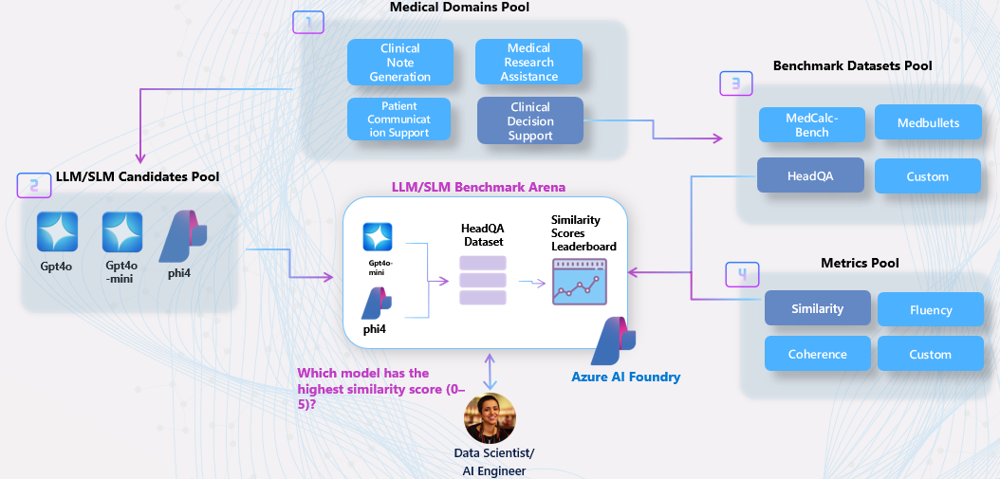

<!-- markdownlint-disable MD033 -->

## **📝 Recap Session 02 – Introducing MedEvals**

> In this session, we introduced [MedEvals](https://github.com/Azure-Samples/aihlsignited-medevals), an end-to-end evaluation framework for medical AI applications built on **Azure AI Foundry**. Inspired by Stanford’s MedHELM benchmark, MedEvals enables providers and payers to systematically validate performance, safety, and compliance of AI solutions across clinical decision support, documentation, patient communication, and more.

### **📦 Assets**

- **[MedEvals Accelerator](https://github.com/Azure-Samples/aihlsignited-medevals)** – Source code and notebooks for the MedEvals evaluation framework.
- **[.pptx/Slides](https://github.com/microsoft/aihlsIgnited/blob/main/hlsignited/FY25/02-Evaluating-LLMs/assets)** – Presentation slides on evaluating LLMs in clinical contexts.

### **🧠 Why Scalable Evaluation Is Critical for Medical AI**

> "Large language models (LLMs) hold promise for tasks ranging from clinical decision support to patient education. However, evaluating the performance of LLMs in medical contexts presents unique challenges due to the complex and critical nature of medical information."  
> — *[Evaluating large language models in medical applications: a survey](https://arxiv.org/abs/2405.07468?utm_source=chatgpt.com)*

As AI systems become deeply embedded in healthcare workflows, the need for rigorous evaluation frameworks intensifies. Although large language models (LLMs) can augment tasks ranging from clinical documentation to decision support, their deployment in patient-facing settings demands systematic validation to guarantee safety, fidelity, and robustness. Benchmarks such as [MedHELM](https://crfm.stanford.edu/helm/medhelm/latest/) address this requirement by subjecting models to a comprehensive battery of clinically derived tasks built on dataset (ground truth), enabling fine-grained, multi-metric performance assessment across the full spectrum of clinical use cases.​  

## 🚀 Getting Started

Kick off your MedEvals journey by following our curated labs. Newcomers to Azure AI Foundry can start with the foundational workflow; seasoned practitioners can dive into advanced evaluation pipelines and CI/CD integration.

#### 🧪 Azure AI Evaluation Labs

1. **[labs/01-foundry-basics-custom-evaluations.ipynb](https://github.com/Azure-Samples/aihlsignited-medevals/blob/main/labs/lab-01-foundry-prebuilt-evaluations.ipynb)**  
   Foundry Basics & Custom Evaluations: Authenticate, initialize a Foundry project, run built-in metrics, and build custom evaluators with EvalAI and PromptEval.

2. **[labs/02-search-evaluations-upload-analyze.ipynb](https://github.com/Azure-Samples/aihlsignited-medevals/blob/main/labs/lab-02-search-evaluations-upload-analyze.ipynb)**  
   Search & Retrieval Evaluations: Prepare datasets, execute search metrics (precision, recall, NDCG), visualize results, and register evaluators in Foundry.

3. **[labs/03-repeatable-evaluations-ci-cd.ipynb](https://github.com/Azure-Samples/aihlsignited-medevals/blob/main/labs/lab-03-repeatable-evaluations-ci-cd.ipynb)**  
   Repeatable Evaluations & CI/CD: Define evaluation schemas, build deterministic pipelines with PyTest, and automate drift detection using GitHub Actions.

#### 🏥 Use Cases

+ **[usecases/usecase-01-clinical-evaluation-with-revcycle.ipynb](https://github.com/Azure-Samples/aihlsignited-medevals/blob/main/usecases/usecase-01-clinical-evaluation-with-revcycle.ipynb)**  
  Creating Your Clinical Evaluation with RevCycle Determinations: Select a model and metric that best supports the determination behind the rationale made on a prior authorization use case.  
  This use case includes:  
  - Selecting multiple candidate LLMs (e.g., `gpt-4o`, `o1`)  
  - Breaking down determinations both in deterministic results (approved vs rejected) and the supporting rationale and logic.  
  - Running evaluations across multiple dimensions  
  - Combining deterministic evaluators and LLM-as-a-Judge methods  
  - Evaluating the differential impacts of evaluators on the rationale across scenarios  

  **Why it matters**:  
  Enables data-driven metric selection for clinical workflows, ensures transparent benchmarking, and accelerates safe AI adoption in healthcare.

 

  

 

+ **[usecases/usecase-02-evaluating-medical-notes-summarization-tasks.ipynb](https://github.com/Azure-Samples/aihlsignited-medevals/blob/main/usecases/usecase-02-evaluating-medical-notes-summarization-tasks.ipynb)**  
  Evaluating AI Medical Notes Summarization Applications: Systematically assess how different foundation models and prompting strategies perform on clinical summarization tasks, following the MedHELM framework.  
  This use case includes:  
  - Preparing real-world datasets of clinical notes and summaries  
  - Benchmarking summarization quality using relevance, coherence, factuality, and harmfulness metrics  
  - Testing prompting techniques (zero-shot, few-shot, chain-of-thought prompting)  
  - Evaluating outputs using both automated metrics and human-in-the-loop scoring  

  **Why it matters**:  
  Ensures responsible deployment of AI applications for clinical summarization, guaranteeing high standards of quality, trustworthiness, and usability.

## **📚 More Resources**

- **[Azure AI Foundry](https://azure.microsoft.com/en-us/products/ai-foundry/)** – Platform for developing, deploying, and managing AI with built-in evaluation and observability.
- **[Evaluating Generative AI with Foundry](https://learn.microsoft.com/azure/ai-foundry/concepts/evaluation-approach-gen-ai)** – Learn Foundry’s approach for performance and safety assessments.
- **[MedHELM Benchmark](https://crfm.stanford.edu/helm/medhelm/latest/)** – Stanford’s healthcare LLM evaluation suite.
- **[Foundry Evaluation SDK](https://github.com/MicrosoftDocs/azure-ai-docs/blob/main/articles/ai-foundry/how-to/develop/evaluate-sdk.md)** – SDK for authoring and running evaluations locally or in the cloud, with built-in and custom evaluators.

 

> [!IMPORTANT]  
> This software is for demonstration only and not intended for production workloads. Use at your own risk.
