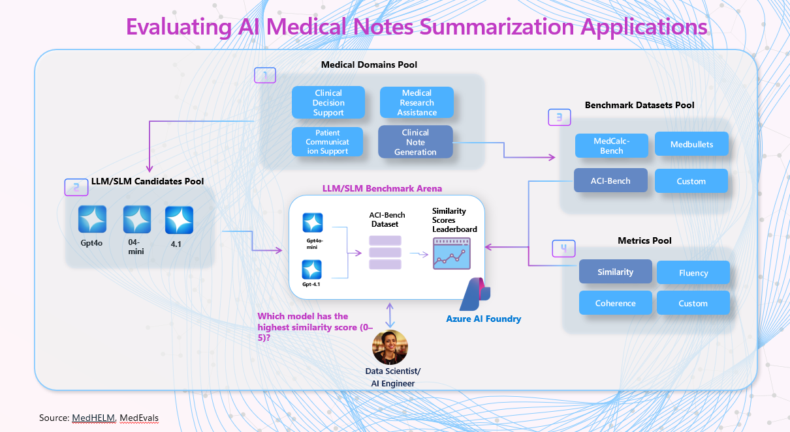

<!-- markdownlint-disable MD033 -->

## **🩺 Recap Session 03 – Advanced Clinical Summarization with Azure OpenAI: From Conversations to SOAP Notes**

> In this session, we explored the capabilities of Azure OpenAI in transforming unstructured clinical conversations into structured, actionable SOAP notes. We examined the nuances of clinical language understanding by LLMs and evaluated their performance against established benchmarks and ground truth data (ACI-Bench Dataset).

### **📦 Assets**

- **[Medical Summarization Notebook](https://github.com/Azure-Samples/aihlsignited-medevals/blob/main/usecases/usecase-02-evaluating-medical-notes-summarization-tasks.ipynb)** – Detailed steps for evaluating summarization tasks using Azure OpenAI.
- **[ACI-Bench Dataset](https://arxiv.org/abs/2306.02022)** – Synthetic yet realistic clinical data for benchmarking automatic visit note generation.

### **🧠 The Imperative for Structured Clinical Documentation**

> "Clinicians spend 52 to 102 minutes daily on documentation tasks—time which directly contributes to burnout. Leveraging LLMs to automate accurate note summarization offers a promising solution."
— ACI-BENCH: Ambient Clinical Intelligence Dataset, Nature Scientific Data (2023)

The traditional process of documenting patient encounters is time-consuming and prone to variability. SOAP notes—comprising Subjective, Objective, Assessment, and Plan sections—provide a standardized framework for clinical documentation. Automating the generation of these notes using Azure OpenAI can enhance efficiency and consistency in clinical workflows.

### **🧪 Azure OpenAI in SOAP Note Generation**

Recent studies have demonstrated the potential of LLMs in generating comprehensive SOAP notes from doctor-patient conversations. For instance, Krishna et al. (2021) introduced a [modular summarization](https://aclanthology.org/2021.acl-long.384/?utm_source=chatgpt.com) approach that combines extractive and abstractive techniques to generate SOAP notes, achieving promising results in capturing clinical nuances .
ResearchGate

Further, the [CLINICSUM framework](https://arxiv.org/abs/2412.04254?utm_source=chatgpt.com) utilizes a two-module architecture: a retrieval-based filtering module that extracts SOAP information from conversation transcripts, and an inference module powered by fine-tuned Pre-trained Language Models (PLMs), which leverage the extracted SOAP data to generate abstracted clinical summaries.

### **📊 Evaluation Against Ground Truth**

To assess the fidelity of AI-generated SOAP notes, evaluations are conducted against ground truth data using both automated metrics (e.g., ROUGE, BERTScore) and expert human assessments. The ACI-Bench dataset serves as a valuable resource in this context, providing synthetic yet [clinically realistic](https://www.researchgate.net/publication/353487617_Generating_SOAP_Notes_from_Doctor-Patient_Conversations_Using_Modular_Summarization_Techniques?utm_source=chatgpt.com) data for benchmarking. 

In a study focusing on pediatric rehabilitation, AI-generated SOAP notes were evaluated for quality and consistency. The findings indicated that with appropriate fine-tuning and human oversight, AI-generated notes can achieve quality comparable to those authored by clinicians.

### **🧠 Understanding Clinical Nuance**

LLMs, particularly those integrated into Azure OpenAI, have shown proficiency in understanding and generating text that captures the subtleties of clinical language. By leveraging large-scale training data and fine-tuning on domain-specific datasets, these models can produce summaries that reflect the complexity and nuance inherent in clinical documentation.

### **🚀 Quantifying How Well LLMs/SLMs Summarize Clinical Documentation**

We didn’t just benchmark models—we built a reusable evaluation framework that (1) highlights inter-model differences, (2) removes random noise so we can quantify quality, (3) measures the impact of prompt-engineering tweaks on model decisions, and (4) preserves a clear causal trace from each generated SOAP field back to the source dialogue.

Our process included:

 

  

 

 + **Model Selection**: Evaluating leading models: GPT-4o, Phi-3, GPT-4.1, assessing their ability to generate coherent, clinically precise summaries.
 - **Dataset Utilization**: Employing the ACI-Bench dataset, which offers realistic simulated patient-clinician interactions paired with comprehensive clinical notes, ensuring robust evaluation conditions.
 + **Rigorous Evaluation**: Combining traditional metrics and LLM-as-a-Judge methodologies, ensuring nuanced evaluation of the clinical accuracy, coherence, factual correctness, and relevance of generated summaries.
 - **Visualization and Leaderboard**: Developing interactive dashboards in Azure AI Foundry and Streamlit to visualize evaluation outcomes clearly, enhancing interpretability and transparency.

#### **🧪 Lab Highlights**

+ **SOAP-Aware Scoring** – Separate metric decks for S, O, A, P so we can see where each model excels or struggles (e.g., GPT-4o strongest on “Plan,” Phi-3-mini best on “Subjective” empathy phrases).
- **Prompt-Engineering Sensitivity** – A single instruction tweak (“bullet list” → “full sentences”) shifted factuality ±6 points, proving the need for structured prompt version control.

## **📚 More Resources**

- **[MedHELM Benchmark](https://crfm.stanford.edu/helm/medhelm/latest/)** – Stanford’s healthcare LLM evaluation suite.
- **[Foundry Evaluation SDK](https://github.com/MicrosoftDocs/azure-ai-docs/blob/main/articles/ai-foundry/how-to/develop/evaluate-sdk.md)** – SDK for authoring and running evaluations locally or in the cloud, with built-in and custom evaluators.
- **[Survey on LLM Clinical Note Generation](https://arxiv.org/pdf/2408.14568)** – 2024 survey detailing best practices, common error modes, and open research questions for automated clinical note writing.
- **[LLM-Driven SOAP Evaluation](https://arxiv.org/pdf/2406.02826)** – Fine-grained rubric and dataset annotating hallucinations and omissions in generated SOAP notes across multiple LLMs.

 

> [!IMPORTANT]  
> This software is for demonstration only and not intended for production workloads. Use at your own risk.
