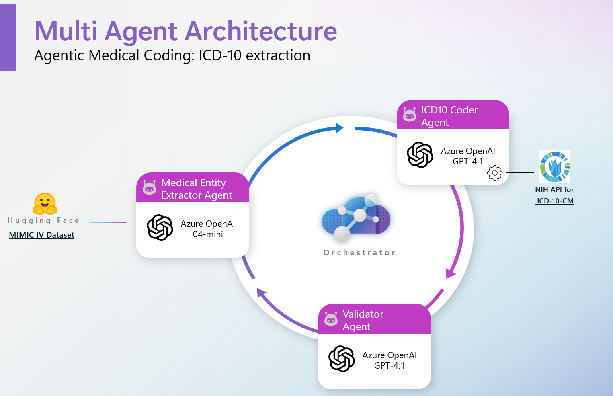

<!-- markdownlint-disable MD033 -->

# **📝 Recap Session 04 – Reducing Administrative Burdens in Healthcare Billing and Coding with AI**

> In this session, we introduced **Agentic ICD-10 code extraction**, designed to automatically extract and code medical information from clinical notes using a multi-agent architecture (MAS). This system employs Generative AI (Azure OpenAI GPT4.1 and reasoning model such as o4-mini) to identify medical entities, a medical coding API (NIH Clinical Tables API) to find corresponding ICD-10 codes, and a validation process to ensure accuracy. The workflow is iterative, allowing for refinement based on validation feedback. Scripts are included for evaluating the system's performance in terms of metrics like precision and recall.

## **📦 Assets**

- **[ICD-10 exctraction using AI Agents- Accelerator](https://github.com/MoreDhanshri/medical-coding-multi-agent-system)** – Source code and notebooks for the ICD-10 exctraction.
- **[.pptx/Slides](https://github.com/microsoft/aihlsIgnited/blob/main/hlsignited/FY25/04-Medical-Coding/assets)** – Presentation slides on evaluating LLMs in clinical contexts.

## **🧠 Why AI agent system to extract ICD-10 codes?**

### **Benefit for Provider**

- **Enhanced Documentation Efficiency**  
  AI-driven tools streamline documentation processes, enhancing efficiency by 2.7× and saving physicians an hour daily.

- **Improved Billing Accuracy**  
  AI can be used for assigning CPT codes, reducing the $18 billion wasted on denied claims.

- **Operational Efficiency**  
  Automating tasks increases operational efficiency and preserves cash flow, contributing to a more streamlined healthcare billing process.

- **Boost in Staff Satisfaction**  
  Reducing administrative burden through AI boosts staff satisfaction by 13–17% in pilot programs, promoting a better working environment.

---

### **Benefit for Payer**

- **Streamlining Claims Processing**  
  AI improves the efficiency of claims processing, saving insurance payers over $11 billion annually and reducing processing times by 30%.

- **Enhanced Fraud Detection**  
  MAS with reasoning models can enhance fraud detection capabilities, identifying anomalies in real time to prevent fraudulent activities.

- **Early Intervention for At-risk Populations**  
  Predictive models powered by AI aid in early intervention for at-risk populations, improving health outcomes and reducing costs.

- **AI-enabled Prior-authorization Tools**  
  AI-enabled prior-authorization tools save 4 minutes per case, reducing treatment delays and enhancing the overall experience for patients.

---

## 🏗️ Architecture

  

The system uses a multi-agent, iterative workflow for ICD-10 code extraction and validation:

1. **Medical Entity Extractor Agent**: Uses LLMs to extract relevant diagnoses, symptoms, and conditions from clinical text.
2. **ICD-10 Coder Agent**: Maps extracted entities to ICD-10-CM codes using the NLM Clinical Tables API and LLM reasoning.
3. **Validator Agent**: Reviews the suggested codes for accuracy and completeness, providing feedback for iterative refinement.

**Workflow:**
- Input clinical text is processed by the Medical Entity Extractor.
- Extracted entities are coded by the ICD-10 Coder Agent (with API lookup).
- The Validator Agent checks the codes and provides feedback.
- The process iterates until codes are satisfactory or a maximum number of iterations is reached.

**Technologies:**
- Agent SDK
- Azure OpenAI (gpt4.1 and o4-mini)
- NLM Clinical Tables API (ICD-10 lookup)

## 🚀 Getting Started
### Project Structure

- `ICD10_MAS.py`: Main code implementing the multi-agent workflow for ICD-10 extraction.
- `ICD10_MAS_improvedfeedback.py`: Alternative/experimental agent workflow with improved feedback.
- `evaluate.py`: Evaluation utilities for computing precision, recall, F1, and accuracy.
- `test_workflow.ipynb`: Example notebook for running and testing the workflow 

- `test_workflowHLSIgniteDemo.ipynb`: Demo test notebook for HLS Ignite.

 

> [!IMPORTANT]  
> This software is for demonstration only and not intended for production workloads. Use at your own risk.
