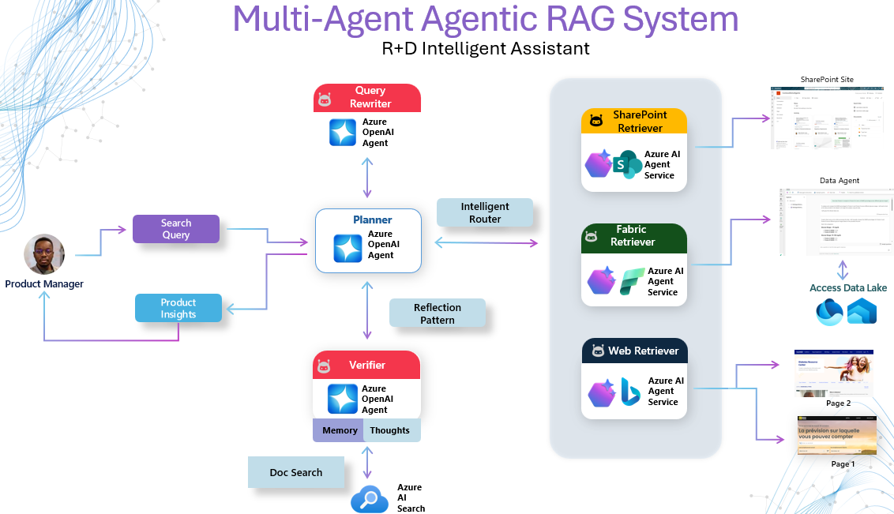

<!-- markdownlint-disable MD033 -->

# 📝 Recap Session 05 – Optimizing Clinical Data Retrieval with Agentic Systems

> In this session, we explored [Agentic RAG](https://github.com/pablosalvador10/gbb-ai-agenticrag) —demonstrating how autonomous agents built with Azure AI Foundry Agent Service and orchestrated with Semantic Kernel can supercharge clinical data retrieval pipelines. By combining a dynamic reflection-driven planning and enterprise single agents healthcare teams can now “send the AI to the data,” delivering context-rich answers in real time across Fabric, SharePoint, Bing, and Azure AI Search.

[](https://www.youtube.com/watch?v=eJ_eS-V_Bvk)

<div align="center">

**▶️ [Watch the demo video on YouTube](https://www.youtube.com/watch?v=eJ_eS-V_Bvk)**

</div>

### **📦 Assets**

- **[AgenticRAG Accelerator](https://github.com/pablosalvador10/gbb-ai-agenticrag)** - Source code, Streamlit app, and notebooks for building AgenticRag Systems. 
- **[Demo Video (YouTube)](https://www.youtube.com/watch?v=eJ_eS-V_Bvk)** - Eight-minute walkthrough of the end-to-end workflow.
- **[Slides (.pptx)](https://github.com/microsoft/aihlsIgnited/blob/main/hlsignited/FY25/05-AgenticRag/assets/AgenticRAG.pptx)** - Deck used in the live session covering concepts, patterns, and best practices.

### **🧠 Why Agentic RAG Is a Game-Changer for Healthcare**

> "Agentic Retrieval-Augmented Generation transcends the limits of static pipelines by embedding autonomous AI agents that reflect, plan, and collaborate to deliver the right context at the right moment."  
> — Singh et al., Agentic RAG Survey (arXiv 2501.09136v3)

Clinical knowledge is vast, multi-modal, and scattered across warehouses, lakehouses, intranets, and the open web. Traditional RAG pipelines run a single query, fetch a handful of chunks, and hope for the best. **Agentic RAG** introduces a closed-loop pattern—**plan → retrieve → verify → rewrite → synthesize**—ensuring every answer is evidence-backed, conflict-free, and audit-ready.  
**The result:** Faster insights, sharper decisions, and safer AI adoption.

Enterprises today wrestle with siloed data and rigid, one‑shot retrieval pipelines that quickly go stale. Agentic RAG empowers organizations to move beyond “thought: data” reasoning—automating continuous **search**, **validation**, and **action** across all their information sources in real time. By adopting this component‑based, autonomous agentic retrieval approach, you transform static RAG into a self‑optimizing intelligence layer—delivering governed, real‑time insights and actions at enterprise scale. Put simply, the AI does all the legwork—locating, validating, and polishing the critical retrieval step. We know LLM/SLM models are formidable, but only when they receive the right context. Put simply, the AI does all the legwork—locating, validating, and polishing the critical retrieval step. We know LLMs/SLMs are formidable, but only when they receive the right context. **Agentic RAG aims to automate that hand-off, providing an LLM with the precise information it needs at exactly the right moment.** 

> [!NOTE]  
> Fresh from Build 2025: If you’re interested in this space, I highly recommend exploring [Azure AI Search’s approach](https://techcommunity.microsoft.com/blog/azure-ai-services-blog/introducing-agentic-retrieval-in-azure-ai-search/4414677) and the latest developments in agentic retrieval.

## **🤖 Building Agentic Systems in Azure**

Our approach in ths repo is to keep it simple and to the point, starting with the development of robust, scalable **enterprise single agents** using the Azure AI Foundry Agent Service. These production-ready agents come equipped with integrated tools, persistent memory, traceability, and isolated execution—providing a solid foundation before scaling up.

Then, of course, we'll tackle communication patterns between single agents. Just as clear conversation drives human collaboration, real-time event exchange between agents unlocks their full potential as a cohesive system. By leveraging frameworks like **Semantic Kernel**—or even crafting your own— you can establish an event-driven architecture that seamlessly ties everything together (single-agents) to build multi-agent systems. Here is my high level formula to build MaS

```text
Multi-Agent Architecture = Σ (Production-Ready Single Agents [tools, memory, traceability, isolation]) + Preferred Framework (e.g., Semantic Kernel, AutoGen)
```

**Breaking It Down**

- **Step 1:** Build robust, scalable single agents with the **Azure AI Foundry Agent Service**, managing them as micro-services.
- **Step 2:** For complex tasks, deploy a fleet of specialized agents that communicate seamlessly via an event-driven framework of your choice.

## **🚀 Getting Started**

Whether you’re new to Azure AI Foundry or already running single agents in production, the curated labs below walk you from “Hello Agent” to a full multi-agent RAG app.

### **🧪 AgenticRAG Labs**

- **Intro to Azure AI Foundry Agent Service**: 🧾 [Notebook – Building Single Agents with Azure AI Foundry Agent Service](https://github.com/pablosalvador10/gbb-ai-agenticrag/blob/main/labs/01-single-agent-with-azure-ai-agents.ipynb.ipynb)  
  Provision your Azure AI Foundry Agent Service instance, configure OBO authentication, and register your first Planner agent.
- **Azure Fabric Retriever Agent**: 🧾 [Notebook – Connecting Microsoft Fabric to Your Agents](https://github.com/pablosalvador10/gbb-ai-agenticrag/blob/main/labs/02-azure-fabric-retriever-agent.ipynb)  
  Create and register a Fabric Data Agent to transform lakehouse and warehouse tables into conversational Q&A.
- **Azure SharePoint Retriever Agent**: 🧾 [Notebook – Connecting SharePoint Sites to Your Agents](https://github.com/pablosalvador10/gbb-ai-agenticrag/blob/main/labs/03-azure-sharepoint-retriever-agent.ipynb)  
  Connect to SharePoint, and surface documents, blueprints, and notes in context.
- **Azure Bing Retriever Agent**: 🧾 [Notebook – Connecting Real-Time Data to Your Agents](https://github.com/pablosalvador10/gbb-ai-agenticrag/blob/main/labs/04-azure-bing-retriever-agent.ipynb)  
  Connect to the Web, and surface latest news, research to add real-time context.

## **🏥 Use Cases**

### **R&D Insights for CGM Devices**  

<div align="center">



</div>
<br>

When Elena Reyes, a stellar Product Manager at Contoso (a MedTech company), was racing to prove her team’s next-gen CGM could meet tight clinical benchmarks, she needed reliable insights—fast. That’s when she turned to our system leveraging Agentic RAG. It deploys lean “data,” “verification,” and “synthesis” agents that automatically pull metrics from SharePoint, Fabric, and live web sources, cross-check every fact, and merge them into one traceable insight—slashing time-to-insight and boosting confidence in CGM performance decisions. Exactly what she needed to make her research more productive, one (or few) **queries bringing the right information to the right person at the right time**. 

How the system works:

1. **Planning & Intelligent Routing**  
  The **Planner Agent** parses the user question, builds an intent map, and selects the optimal retriever agents—e.g., **Fabric Retriever** (lakehouse metrics), **SharePoint Retriever** (design docs), or **Web Retriever** (market studies).  
  *Optionally*, the Planner may call the **Query Rewriter** up front to maximise retrieval precision.

2. **Retrieval**  
  The selected *family agents* run in parallel, each pulling evidence from its source of truth.

3. **Verification / Reflection Layer**  
  A dedicated **Verifier Agent** cross-checks results, detects contradictions, and confirms that the aggregated evidence actually answers the original intent.

4. **Insight Synthesis**  
  - **If verification passes:** the Planner merges validated evidence into a concise, actionable response and returns it to the user.  
  - **If verification fails:** the Verifier triggers the **Query Rewriter**, which refines the search terms; the Planner re-routes the new query to the relevant retrievers and the cycle repeats.

This closed-loop **plan → retrieve → verify → (rewrite) → synthesize** pattern ensures every answer is context-rich, conflict-free, and delivered in real time.

> [!INFO]  
> **Design Principle:** For this app rather than emergent “chatter” between many autonomous agents, we use specialized, stateless single agents orchestrated by a central Router. This yields deterministic, auditable reasoning flows—every step from retrieval to verification is logged and 'repeatable'.

### **Clinical Guidelines Look-up**  
Swap Fabric for Azure AI Search to ground decisions on ICD-10/RxNorm-enriched policy docs, ensuring the latest criteria are applied automatically.

> **Why it matters:** Agentic RAG automates the legwork—query rewriting, cross-source validation, and insight synthesis—so clinicians and analysts can focus on decisions, not data wrangling.

## **🤖 Building Blocks Recap**

**Multi-Agent Architecture:**  
```text
Multi-Agent Architecture = Σ (Production-Ready Single Agents [tools, memory, traceability, isolation]) + Preferred Framework (e.g., Semantic Kernel, AutoGen)
```
**AgenticRAG Architecture:**  
- **Planner Agent:** Parses intent, selects retrievers, and routes queries.
- **Family Retriever Agents:** Fabric, SharePoint, Web, Azure AI Search.
- **Verifier Agent:** Cross-checks evidence; triggers Query Rewriter on failure.
- **Synthesis:** Returns a concise, traceable answer once evidence is verified.

> [!INFO]  
> We favor deterministic single-agent micro-services orchestrated by a central router for auditability and repeatability.

## **📚 More Resources**

- **[Azure AI Foundry](https://azure.microsoft.com/en-us/products/ai-foundry/?msockid=0b24a995eaca6e7d3c1dbc1beb7e6fa8#Use-cases-and-Capabilities)**: Develop and deploy custom AI apps and APIs responsibly with a comprehensive platform.
- **[Azure AI Foundry Agent Service](https://learn.microsoft.com/en-us/azure/ai-services/agents/overview)**: Learn about Azure AI Foundry Agent Service and its capabilities.
- **[Semantic Kernel Documentation](https://learn.microsoft.com/en-us/semantic-kernel/overview/)**: Detailed documentation on Semantic Kernel's features and capabilities.
- **[Fabric Data Agent](https://learn.microsoft.com/en-us/azure/ai-services/agents/how-to/tools/fabric?tabs=csharp&pivots=overview)** – How‑to guide on connecting Microsoft Fabric to your Agentic RAG pipeline.  
- **[SharePoint Data Agent](https://learn.microsoft.com/en-us/azure/ai-services/agents/how-to/tools/sharepoint?tabs=csharp&pivots=overview)** – Steps to configure OBO and surface SharePoint content via agents.  
- **[Grounding with Bing Search](https://learn.microsoft.com/en-us/azure/ai-services/agents/how-to/tools/bing-grounding?tabs=python&pivots=overview)** – Documentation for integrating live web search into your workflows.  
- **[Azure AI Search tool](https://learn.microsoft.com/en-us/azure/search/semantic-vector-search-overview)** – Semantic and vector search capabilities to enrich retrieval.  

> [!IMPORTANT]  
> This software is for demonstration only and not intended for production workloads. Use at your own risk.